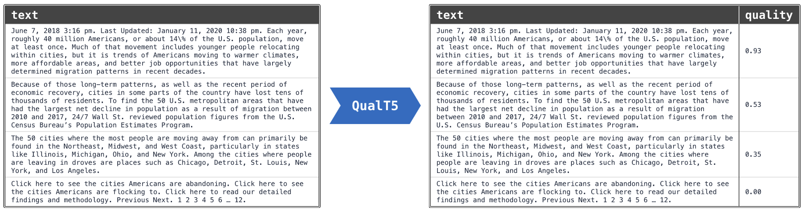

# Containerised Quality Scoring

Content quality estimation using PyTerrier.


(https://github.com/terrierteam/pyterrier-quality/blob/main/img/qual-predict.png)

## Installation

Clone this repository
```bash
git clone https://github.com/ArianeS21/quality_scoring.git
```

## Usage
The application can be run in any environment that supports docker (e.g. locally or on a compute cluster).

1. Build the image
```bash
docker build -t <username>/quality-scoring:latest .
 ```
2. (Optional) Push the image 
```bash
docker push -t <username>/quality-scoring:latest
```
3. Run the container
```bash
docker run -it --name qual-scoring --mount type=bind,src=<absolute/output/dir/path>,dst=/outputs --mount type=bind,src=<absolute/input/dir/path>,dst=/inputs <username>/qual-scoring-test:latest
```
**Note:** Windows machines (particularly Windows 11 Home machines) may have issues mounting the inputs directory (i.e. the mounted directory in the container may be empty). 
If you encounter issues, please ensure that WSL2 integration is enabled for Docker (see https://docs.docker.com/desktop/features/wsl/).
If the issue persists, the container will output a warning that the input directory is empty and will wait until files are available. 
To make your input files available in the input folder, execute the following command in a separate terminal to copy the input files into the container:
```bash
docker cp <input/dir/path>/. qual-scoring:/inputs
```

You can specify the desired output format via the ```--output-format``` parameter. Supported formats are:
  - csv ([PyTerrier format (docno, text)](https://pyterrier.readthedocs.io/en/latest/datamodel.html))
  - json ([PyTerrier format (docno, text)](https://pyterrier.readthedocs.io/en/latest/datamodel.html))
  - json.gz ([ClueWeb22 format](https://lemurproject.org/clueweb22/docspecs.php))
  - parquet ([OWI format](https://opencode.it4i.eu/openwebsearcheu-public/preprocessing-pipeline))
  ```bash
docker run -it --name qual-scoring --mount type=bind,src=<absolute/output/dir/path>,dst=/outputs --mount type=bind,src=<absolute/input/dir/path>,dst=/inputs <username>/qual-scoring-test:latest --output-format json
  ```

**Note:** If you encounter the mount issue mentioned above, you may have to manually copy the output file to your host:
```bash
docker cp qual-scoring:/outputs/output.<format> </host/output/path>
```

## Models
The following pre-trained QualT5 models are available:

| Model ID | Base Model |
|----------|------------|
|[`pyterrier-quality/qt5-tiny`](https://huggingface.co/pyterrier-quality/qt5-tiny)|[`google/t5-efficient-tiny`](https://huggingface.co/google/t5-efficient-tiny)|
|[`pyterrier-quality/qt5-small`](https://huggingface.co/pyterrier-quality/qt5-small)|[`t5-small`](https://huggingface.co/t5-small)|
|[`pyterrier-quality/qt5-base`](https://huggingface.co/pyterrier-quality/qt5-base)|[`t5-base`](https://huggingface.co/t5-base)|

You can specify the desired model via the command line parameter ```--model```:
```bash
docker run -it --name qual-scoring --mount type=bind,src=<absolute/output/dir/path>,dst=/outputs --mount type=bind,src=<absolute/input/dir/path>,dst=/inputs <username>/qual-scoring-test:latest --model tiny
```